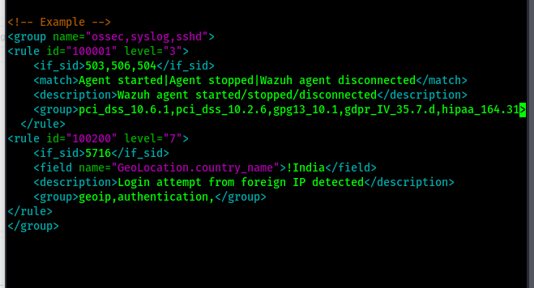
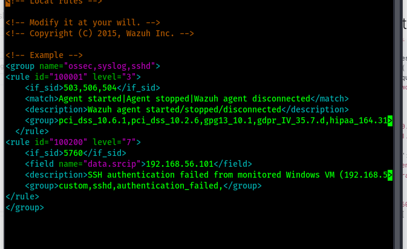
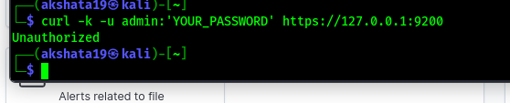
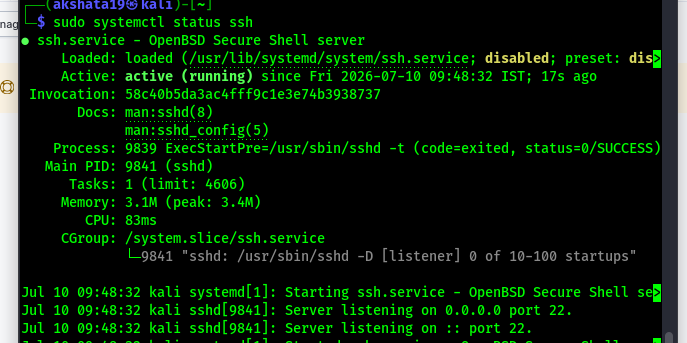
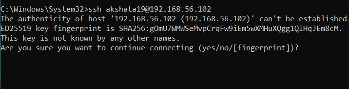
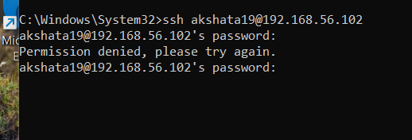
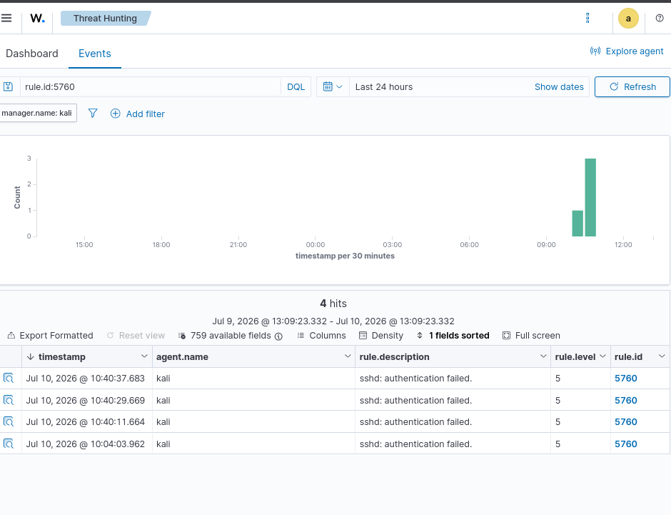
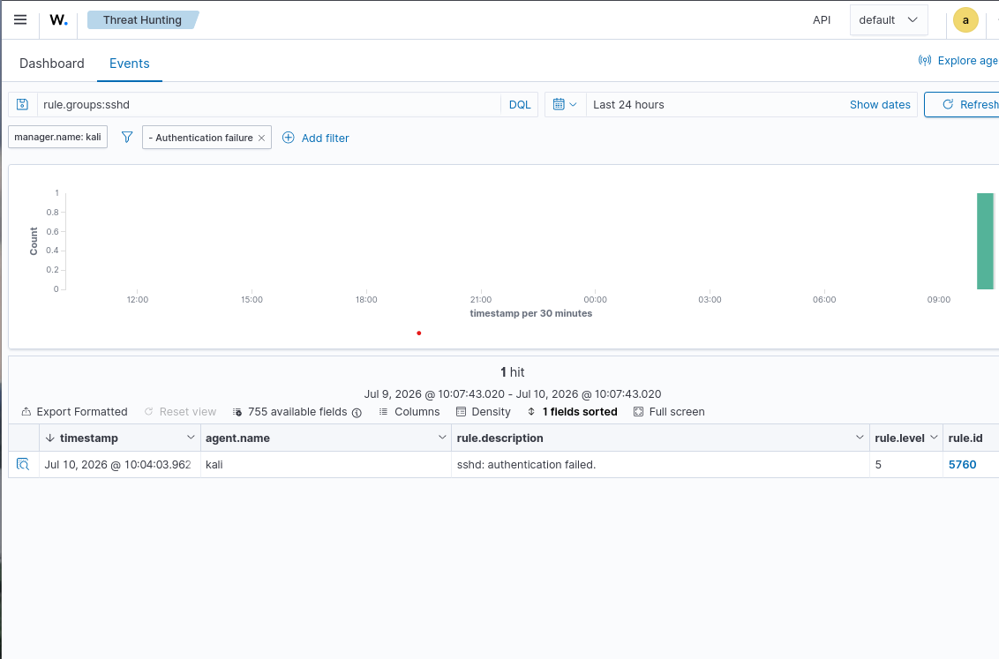

# Wazuh Custom Rule Engineering

## Overview

This project demonstrates the development, validation, and testing of a custom Wazuh detection rule for SSH authentication failures in a virtual SOC environment.

The project simulates failed SSH login attempts from a Windows virtual machine to a Kali Linux server running the Wazuh Manager. Authentication failures are detected by Wazuh, investigated using Threat Hunting, and analyzed through the Wazuh Dashboard.

---

## Project Objectives

- Create a custom Wazuh detection rule.
- Validate the custom rule before deployment.
- Configure the SSH service for testing.
- Generate SSH authentication failures.
- Detect authentication failures using Wazuh.
- Investigate events using Threat Hunting.
- Visualize alerts in the Wazuh Dashboard.

---

## Lab Environment

| Component | Description |
|-----------|-------------|
| Host Machine | Windows Laptop |
| Client VM | Windows VM (192.168.56.101) |
| Server VM | Kali Linux (192.168.56.102) |
| SIEM Platform | Wazuh 4.x |
| Operating System | Kali Linux |
| Communication | SSH |
| Virtualization | VirtualBox |

---

## Project Structure

```
wazuh-custom-rule-engineering/
│
├── configuration/
│   ├── local_rules.xml
│   ├── ssh-configuration.md
│   └── validation-commands.md
│
├── queries/
│   └── threat-hunting-query.md
│
├── screenshots/
│   ├── custom-rule.png
│   ├── rule-validation.png
│   ├── password-authentication.png
│   ├── ssh-service-running.png
│   ├── ssh-connection.png
│   ├── failed-authentication.png
│   ├── threat-hunting-events.png
│   └── dashboard-overview.png
│
└── README.md
```

---

# Implementation

## Step 1 – Create Custom Wazuh Rule

A custom detection rule was created in:

```
/var/ossec/etc/rules/local_rules.xml
```

The rule extends the existing SSH authentication detection rule and identifies failed SSH authentication attempts originating from the Windows virtual machine.

### Configuration

```xml
<rule id="100200" level="7">
    <if_sid>5760</if_sid>
    <field name="data.srcip">192.168.56.101</field>
    <description>SSH authentication failed from monitored Windows VM (192.168.56.101)</description>
    <group>custom,sshd,authentication_failed,</group>
</rule>
```

### Screenshot



---

## Step 2 – Validate the Rule

Before deployment, the configuration was validated.

Command used:

```bash
sudo /var/ossec/bin/wazuh-analysisd -t
```

Purpose:

- Validate XML syntax
- Detect configuration errors
- Ensure the Wazuh Manager can load the rule

### Screenshot



---

## Step 3 – Configure SSH

Password authentication was enabled for SSH testing.

Verification command:

```bash
sudo sshd -T | grep passwordauthentication
```

Expected output:

```
passwordauthentication yes
```

### Screenshot



---

## Step 4 – Verify SSH Service

The SSH service was confirmed to be running.

Command:

```bash
sudo systemctl status ssh
```

Purpose:

- Verify SSH service availability
- Accept incoming SSH connections

### Screenshot



---

## Step 5 – Generate Authentication Failure

An SSH connection was initiated from the Windows VM to the Kali Linux server.

```
ssh akshata19@192.168.56.102
```

An incorrect password was intentionally entered to generate authentication failure events.

### SSH Connection



### Failed Authentication



---

## Step 6 – Threat Hunting

The generated events were investigated using the Wazuh Threat Hunting module.

Filter used:

```
rule.id:5760
```

The Threat Hunting dashboard displayed:

- SSH authentication failures
- Rule ID 5760
- Kali agent
- Event timestamps
- Alert severity

### Screenshot



---

## Step 7 – Dashboard Analysis

Authentication failures were successfully visualized in the Wazuh Dashboard.

The dashboard provided:

- Authentication failure statistics
- Alert counts
- Timeline visualization
- MITRE ATT&CK mapping
- Security event overview

### Screenshot



---

# Detection Workflow

```
Windows VM
(192.168.56.101)
        │
        ▼
SSH Connection
        │
        ▼
Incorrect Password
        │
        ▼
Authentication Failure
        │
        ▼
Kali SSH Server
(192.168.56.102)
        │
        ▼
Wazuh Rule 5760
        │
        ▼
Custom Rule Evaluation
        │
        ▼
Threat Hunting
        │
        ▼
Dashboard Visualization
```

---

# Skills Demonstrated

- Wazuh Rule Engineering
- SIEM Event Analysis
- SSH Security Monitoring
- Linux Administration
- Threat Hunting
- Log Analysis
- Security Event Investigation
- Detection Engineering
- SOC Operations

---

# Tools Used

- Wazuh
- Kali Linux
- Windows Virtual Machine
- VirtualBox
- OpenSSH
- Linux Terminal

---

# Key Learning Outcomes

- Created a custom Wazuh detection rule.
- Validated custom rule syntax before deployment.
- Configured SSH authentication for testing.
- Generated controlled authentication failures.
- Investigated security events using Threat Hunting.
- Analyzed authentication alerts through the Wazuh Dashboard.
- Understood the complete workflow of detection engineering within a SOC environment.

---

## Author

**Akshata Kattimani**

Cybersecurity | SOC Analyst | SIEM | Wazuh | Threat Hunting | Detection Engineering
