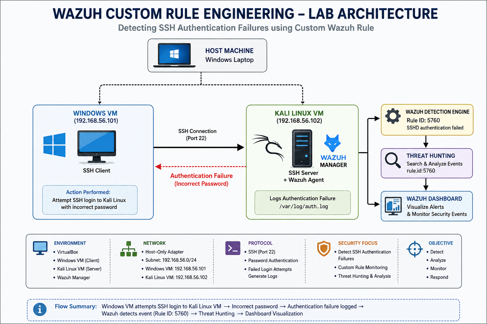

# Wazuh Custom Rule Engineering



## Overview

This project demonstrates the development and testing of a custom Wazuh detection rule for monitoring SSH authentication failures in a virtual Security Operations Center (SOC) lab.

A Windows virtual machine acts as the SSH client, while a Kali Linux virtual machine hosts both the SSH server and the Wazuh Manager. Failed SSH login attempts are generated intentionally, detected by Wazuh, investigated using Threat Hunting, and visualized through the Wazuh Dashboard.

---

# Objectives

- Develop a custom Wazuh detection rule.
- Configure the SSH service for authentication testing.
- Generate failed SSH login attempts.
- Validate Wazuh rule configuration.
- Investigate authentication events using Threat Hunting.
- Analyze alerts through the Wazuh Dashboard.

---

# Lab Architecture


---

# Environment

| Component | Details |
|-----------|---------|
| Host Machine | Windows Laptop |
| Virtualization | VirtualBox |
| Client VM | Windows VM (192.168.56.101) |
| Server VM | Kali Linux (192.168.56.102) |
| SIEM Platform | Wazuh Manager |
| Protocol | SSH |
| Detection | Wazuh Rule Engine |

---

# Project Structure

```
wazuh-custom-rule-engineering/
│
├── configuration/
│   ├── local_rules.xml
│   ├── ssh-configuration.md
│   └── validation-commands.md
│
├── diagrams/
│   ├── architecture.png
│   └── architecture-diagram.md
│
├── queries/
│   └── threat-hunting-query.md
│
├── screenshots/
│   ├── custom-rule.png
│   ├── rule-validation.png
│   ├── password-authentication.png
│   ├── ssh-service-running.png
│   ├── ssh-connection.png
│   ├── failed-authentication.png
│   ├── threat-hunting-events.png
│   └── dashboard-overview.png
│
├── README.md
└── LICENSE
```

---

# Implementation Workflow

## Step 1 – Create Custom Wazuh Rule

A custom detection rule was created in:

```
/var/ossec/etc/rules/local_rules.xml
```

The rule extends the existing SSH authentication detection logic and targets failed SSH login attempts originating from the Windows virtual machine.

### Screenshot


---

## Step 2 – Validate Rule Configuration

The custom rule configuration was validated before deployment.

Validation command:

```bash
sudo /var/ossec/bin/wazuh-analysisd -t
```

Purpose:

- Validate XML syntax
- Detect configuration errors
- Ensure Wazuh can load the custom rule

### Screenshot


---

## Step 3 – Configure SSH

Password authentication was enabled to allow authentication testing.

Verification command:

```bash
sudo sshd -T | grep passwordauthentication
```

Expected Output

```
passwordauthentication yes
```

### Screenshot


---

## Step 4 – Verify SSH Service

The SSH service was confirmed to be active before testing.

Command:

```bash
sudo systemctl status ssh
```

### Screenshot


---

## Step 5 – Generate Failed Authentication

An SSH connection was initiated from the Windows VM to the Kali Linux VM.

```bash
ssh akshata19@192.168.56.102
```

An incorrect password was intentionally entered to generate authentication failure events.

### SSH Connection


### Failed Authentication


---

## Step 6 – Threat Hunting

Authentication failure events were investigated using the Wazuh Threat Hunting module.

Query used:

```
rule.id:5760
```

Observed information:

- Authentication failures
- Rule ID
- Agent name
- Event timestamp
- Alert severity

### Screenshot


---

## Step 7 – Dashboard Analysis

Detected authentication failures were visualized through the Wazuh Dashboard.

The dashboard provides:

- Authentication statistics
- Alert overview
- Event timeline
- MITRE ATT&CK mapping
- Security monitoring dashboard

### Screenshot


---

# Detection Workflow

```
Windows VM
(192.168.56.101)
        │
        ▼
SSH Login Attempt
        │
        ▼
Incorrect Password
        │
        ▼
Authentication Failure
        │
        ▼
Kali Linux SSH Server
(192.168.56.102)
        │
        ▼
Wazuh Detection Engine
        │
        ▼
Threat Hunting Investigation
        │
        ▼
Dashboard Visualization
```

---

# Skills Demonstrated

- Wazuh SIEM
- Custom Rule Engineering
- Detection Engineering
- Threat Hunting
- SSH Security Monitoring
- Linux Administration
- Security Event Analysis
- SOC Operations
- Incident Investigation

---

# Tools & Technologies

- Wazuh
- Kali Linux
- Windows VM
- VirtualBox
- OpenSSH
- Linux CLI

---

# Key Learning Outcomes

- Developed a custom Wazuh detection rule.
- Validated Wazuh rule configuration before deployment.
- Configured SSH for authentication testing.
- Generated controlled authentication failures.
- Investigated security events using Threat Hunting.
- Analyzed alerts through the Wazuh Dashboard.
- Understood the complete detection engineering workflow in a SOC environment.

---

# MITRE ATT&CK

| Technique | Description |
|-----------|-------------|
| T1110 | Brute Force / Password Guessing (Authentication Failures) |

---

# Future Improvements

- Detect repeated authentication failures from a single source IP.
- Trigger Active Response after multiple failed login attempts.
- Integrate GeoIP-based detection.
- Add email or Slack alert notifications.
- Expand detection coverage for SSH attacks.

---

# Author

**Akshata Kattimani**

Cybersecurity Enthusiast | SOC Analyst | Wazuh | SIEM | Threat Hunting | Detection Engineeringtion Engineering
